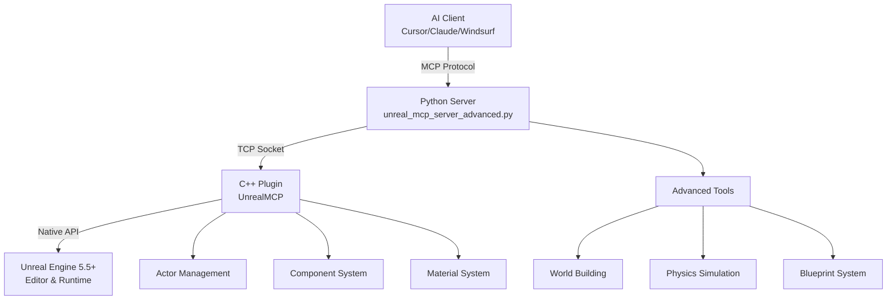

# The Most Advanced MCP Server for Unreal Engine

**Control Unreal Engine 5.5+ through AI with natural language** — This MCP server enables AI clients to build incredible 3D worlds and architectural masterpieces. Create entire towns, medieval castles, modern mansions, challenging mazes, and complex structures with AI-powered commands.

[](https://www.unrealengine.com/)
[](https://discord.gg/3KNkke3rnH)

> **Active Development**: This MCP server is under active development with regular updates and improvements. Join our [Discord](https://discord.gg/3KNkke3rnH) to stay updated on the latest releases!

## See It In Action
Watch our comprehensive tutorial for complete setup and usage:
- **[Complete MCP Tutorial & Installation Guide](https://youtu.be/ct5dNJC-Hx4)** - Full walkthrough of installation, setup, and advanced usage

Check out these examples of the MCP server in action on our channel:
- **[GPT-5 vs Claude](https://youtube.com/shorts/xgoJ4d3d4-4)** - Watch Claude and GPT-5 go head-to-head building simultaneously - Claude creates a massive fortress while GPT-5 builds a sprawling city
- **[Advanced Metropolis Generation](https://youtube.com/shorts/6WkxCQXbCWk)** - Watch AI generate a full-blown metropolis with towers, streets, parks, and over 4,000 objects from a single prompt
- **[Advanced Maze & Mansion Generation](https://youtube.com/shorts/ArExYGpIZwI)** - Watch Claude generate a playable maze and complete mansion complex with wings, towers, and arches

## Featured Capabilities

### Complete Blueprint Visual Scripting

**Program Blueprints entirely through AI** with comprehensive node creation, graph management, and variable systems.

```bash
# Create complex Blueprint logic with control flow, variables, and functions
> "Create a Blueprint with a health system that tracks damage and triggers a death event"
→ create_blueprint() + create_variable() + add_node() + connect_nodes()

# Support for 23+ node types across 6 categories:
# Control Flow: Branch, Comparison, Switch (Byte/Enum/Integer), ExecutionSequence
# Data: VariableGet, VariableSet, MakeArray
# Casting: DynamicCast, ClassDynamicCast, CastByteToEnum
# Utility: Print, CallFunction, Select, SpawnActor
# Specialized: Timeline, GetDataTableRow, AddComponentByClass, Self, Knot
# Animation: PlayAnimation, StopAnimation, Timeline nodes
```

**Advanced Blueprint Features:**
- **Function Management**: Create custom functions with inputs/outputs, rename, and delete
- **Variable System**: Full property control (public/private, replication, tooltips, ranges, units)
- **Node Properties**: Dynamic pin management, type modification, semantic editing
- **Graph Analysis**: Read complete Blueprint content, analyze execution flow, inspect variables
- **Connection System**: Wire nodes together with automatic type validation

### World Building & Architecture  
```bash
# Create massive futuristic cities with skyscrapers, flying cars, and advanced infrastructure
> "Build a massive futuristic city with towering skyscrapers"
→ create_town(town_size="massive", architectural_style="futuristic", building_density=0.95)

# Build complex multi-room houses with windows, doors, and roofs
> "Create a Victorian mansion complex with east and west wing houses."
→ construct_house(house_style="mansion", width=1500, height=900)
```

### Intelligent Mazes
```bash
# Generate solvable mazes with guaranteed paths using recursive backtracking
> "Make a 15x15 maze with high walls"
→ create_maze(rows=15, cols=15, wall_height=4, cell_size=250)
```

---

## Complete Tool Arsenal

| **Category** | **Tools** | **Description** |
|--------------|-----------|-----------------|
| **Blueprint Visual Scripting** | `add_node`, `connect_nodes`, `delete_node`, `set_node_property`, `create_variable`, `set_blueprint_variable_properties`, `create_function`, `add_function_input`, `add_function_output`, `delete_function`, `rename_function` | Complete Blueprint programming with 23+ node types, variables with full property control, custom functions, and dynamic graph management. `connect_nodes` validates via the K2 schema and returns rich `error_details` (available nodes/pins, pin types, schema messages) on failure so agents can self-correct. |
| **Blueprint Analysis & Cleanup** | `read_blueprint_content`, `analyze_blueprint_graph`, `get_blueprint_variable_details`, `get_blueprint_function_details`, `audit_blueprint`, `organize_blueprint_graph` | Deep inspection of Blueprint structure, event graphs, execution flow, variables, functions, graph quality, and readable node layout |
| **Asset Discovery** | `search_assets`, `find_animation_assets`, `get_available_materials` | Generalized Asset Registry search by class + paths (animations, meshes, blueprints, textures, sounds, ...); `find_animation_assets` is a preset over common animation classes |
| **Fab-Safe Asset Workflows** | `detect_fab_status`, `open_fab_browser`, `import_asset`, `bulk_import_assets`, `place_imported_asset`, `tag_imported_assets`, `move_asset`, `rename_asset`, `delete_asset`, `fix_redirectors`, `list_asset_dependencies`, `list_asset_references`, `generate_imported_asset_manifest` | Work with local files and already-licensed project content without automating Fab authentication, purchasing, or downloading |
| **Animation System Integration** | `detect_gasp_assets`, `validate_motion_matching_setup`, `setup_gasp_character`, `retarget_to_gasp`, `detect_als_plugin`, `validate_als_character`, `setup_als_character`, `retarget_to_als` | Detect and validate GASP / ALS prerequisites, then guide safe dry-run setup and retargeting workflows |
| **C++ & Superhero Game Scaffolding** | `create_cpp_class`, `validate_superhero_game_stack`, `scaffold_superhero_cpp_classes` | Generate safe Unreal C++ class stubs as an alternative to Blueprint logic and check/scaffold superhero-game systems like flight, menus, controllers, and customization |
| **World Building** | `create_town`, `construct_house`, `construct_mansion`, `create_tower`, `create_arch`, `create_staircase` | Build complex architectural structures and entire settlements |
| **Epic Structures** | `create_castle_fortress`, `create_suspension_bridge`, `create_aqueduct` | Massive engineering marvels and medieval fortresses |
| **Level Design** | `create_maze`, `create_pyramid`, `create_wall` | Design challenging game levels and puzzles |
| **Physics & Materials** | `spawn_physics_blueprint_actor`, `set_physics_properties`, `apply_material_to_actor`, `apply_material_to_blueprint`, `set_mesh_material_color` | Create realistic physics simulations and material systems |
| **Blueprint System** | `create_blueprint`, `compile_blueprint`, `add_component_to_blueprint`, `set_static_mesh_properties` | Visual scripting and custom actor creation |
| **Actor Management** | `get_actors_in_level`, `find_actors_by_name`, `delete_actor`, `set_actor_transform`, `get_actor_material_info` | Precise control over scene objects and inspection |

---

## Lightning-Fast Setup

### Prerequisites
- **Unreal Engine 5.5+** 
- **Python 3.12+**
- **MCP Client** (Claude Desktop, Cursor, or Windsurf)

### 1. Setup Options

**Option A: Add Plugin to Your Existing Project**
```bash
# Clone the repository
git clone https://github.com/alex-wenner/unreal-engine-mcp.git
cd unreal-engine-mcp

# Copy or symlink UnrealMCP/ into your project's Plugins/ directory, then open your .uproject
# Enable the plugin in Unreal Editor and restart when prompted
```

**Option B: Copy Plugin Manually**
```bash
# Copy the plugin to your project
cp -r UnrealMCP/ YourProject/Plugins/

# Enable in Unreal Editor
Edit → Plugins → Search "UnrealMCP" → Enable → Restart Editor
```

**Option C: Install for All Projects**
```bash
# Copy to Engine plugins folder (available to all projects)
cp -r UnrealMCP/ "C:/Program Files/Epic Games/UE_5.5/Engine/Plugins/"

# Enable in any project through the Plugin Browser
Edit → Plugins → Search "UnrealMCP" → Enable
```

#### Extra steps for Mac
If you're on macOS and Unreal Engine fails to open the project due to compilation errors, you'll need to manually compile the C++ plugin first. To do so, follow these steps:

##### Step 1: Check Your Xcode Version

```bash
xcodebuild -version
xcrun --show-sdk-version
```

Note your Xcode version number (e.g., `26.0.1`, `16.0`, `15.2`, etc.). If your version is newer than 16.0, you'll need to patch the Unreal Engine SDK configuration.

##### Step 2: Patch Unreal Engine SDK Configuration

Edit the file at your Unreal Engine installation (replace `UE_5.X` with your version):

```bash
# Path to edit:
/Users/Shared/Epic Games/UE_5.X/Engine/Config/Apple/Apple_SDK.json
```

Update the following values:

**Change 1:** Update `MaxVersion` to support your Xcode version
```json
{
  "MaxVersion": "YOUR_XCODE_VERSION.9.0",  // e.g., "26.9.0" if you have Xcode 26.x
}
```
Replace `YOUR_XCODE_VERSION` with your major Xcode version from Step 1.

**Change 2:** Add LLVM version mapping for your Xcode version (add to the `AppleVersionToLLVMVersions` array)
```json
{
  "AppleVersionToLLVMVersions": [
    "14.0.0-14.0.0",
    "14.0.3-15.0.0",
    "15.0.0-16.0.0",
    "16.0.0-17.0.6",
    "16.3.0-19.1.4",
    "YOUR_XCODE_VERSION.0.0-19.1.4"  // e.g., "26.0.0-19.1.4" for Xcode 26.x
  ]
}
```
Replace `YOUR_XCODE_VERSION` with your major Xcode version from Step 1.

##### Step 3: Compile the Plugin

Run the Unreal Build Tool to compile the project:

```bash
"/Users/Shared/Epic Games/UE_5.X/Engine/Build/BatchFiles/Mac/Build.sh" \
  UnrealEditor Mac Development \
  -Project="/path/to/YourProject/YourProject.uproject" \
  -WaitMutex
```

Replace:
- `UE_5.X` with your Unreal Engine version (e.g., `UE_5.5`)
- `/path/to/unreal-engine-mcp/` with the actual path to your cloned repository

##### Step 4: Open the Project

Once compilation succeeds, you can open your Unreal project in Unreal Engine.

### 2. Launch the MCP Server

```bash
cd Python
uv run unreal_mcp_server_advanced.py
```

### 3. Configure Your AI Client

Add this to your MCP configuration:

**Cursor**: `.cursor/mcp.json`
**Claude Desktop**: `~/.config/claude-desktop/mcp.json`
**Windsurf**: `~/.config/windsurf/mcp.json`

```json
{
  "mcpServers": {
    "unrealMCP": {
      "command": "uv",
      "args": [
        "--directory",
        "/path/to/unreal-engine-mcp/Python",
        "run",
        "unreal_mcp_server_advanced.py"
      ]
    }
  }
}
```

Note that on Mac, and sometimes on Windows, you may have to replace the "uv" string passed as the value to "command" in the above `mcp.json` file with the exact absolute path to the uv executable. To get that path, run one of these commands:
- Mac: `which uv`
- Windows: `where uv`

> **Having issues with setup?** Check our [Debugging & Troubleshooting Guide](DEBUGGING.md) for solutions to common problems like MCP installation errors and configuration issues.
>
> **Want to program Blueprints with AI?** Check our [Blueprint Graph Programming Guide](Guides/blueprint-graph-guide.md) to learn how to create nodes, connections, and variables programmatically.

### 4. Start Building!

```bash
> "Create a medieval castle with towers and walls"
> "Generate a town square with fountain and buildings"
> "Make a challenging maze for players to solve"
```

---

## Source of Truth & Validation

- `Python/unreal_mcp_server_advanced.py` is the canonical MCP tool manifest; each exposed tool is decorated with `@mcp.tool()`.
- `UnrealMCP/` is the standalone plugin source.
- Lightweight Python tests under `Python/tests/` validate response normalization, actor-name collision handling, and documented core tool exposure.

## Feature-Rich Agent Roadmap

To move toward “anything a human can do in the editor,” prioritize Unreal editor automation surfaces documented by Epic:

- **Undoable editor operations**: wrap mutating C++ commands in `FScopedTransaction` so generated scenes, Blueprint edits, and asset changes can be undone in one step.
- **Asset workflows**: expose asset creation, duplicate, rename, move, delete, reimport, redirector cleanup, and dependency/reference inspection through Asset Tools and Asset Registry APIs.
- **Level editing**: add selection, grouping, folders, layers, snapping, pivot, transform gizmo-style operations, actor replacement, batch tagging, and cleanup-by-prefix/tag.
- **Viewport automation**: expose editor camera control, focus/selection framing, viewport mode changes, screenshots, and visual validation snapshots.
- **Blueprint parity**: add Blueprint validation, compile-all, interface implementation, macro/library support, component hierarchy editing, graph layout, and richer node discovery.
- **Sequencer/cinematics**: create and edit Level Sequences, cameras, tracks, keyframes, bindings, renders, and cinematic previews.
- **Content creation helpers**: add materials, material instances, data assets, data tables, Niagara systems, animations, lights, collisions, LODs, and style palettes.
- **Project/settings automation**: expose input mappings, collision channels, game modes, maps, packaging settings, plugin enablement, and common editor preferences.
- **Safety and planning**: add dry-run estimates, bounding boxes, actor-count limits, progress updates, operation manifests, and generated-scene snapshots.

## Architecture



**Performance**: Native C++ plugin ensures minimal latency for real-time control
**Reliability**: Robust TCP communication with automatic reconnection
**Flexibility**: Full access to Unreal's actor, component, and Blueprint systems

---

## Community & Support

**Join our community and get help building amazing worlds!**

### Connect With Us
- **Discord**: [discord.gg/8yr1RBv](https://discord.gg/3KNkke3rnH) - Get help, share creations, and discuss the plugin

### Get Help & Share
- **Setup Issues?** Check our [Debugging & Troubleshooting Guide](DEBUGGING.md) first
- **Questions?** Ask in our Discord server for real-time support
- **Bug reports?** Open an issue on GitHub with reproduction steps
- **Feature ideas?** Join the discussion in our community channels

---

## License
MIT License - Build amazing things freely.
